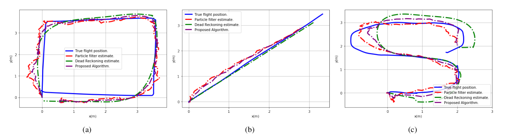

# MUESIPCO2020_Dataset
<h4> a reliable dataset,leveraging specific set of four optical cameras to provide ground truth with millime- ters accuracy. The introduced dataset consists of RSSI values col- lected from five BLE sensors together with synchronized Inertial Measurement Unit (IMU) signals from the target’s mobile device.</h4>

## Dataset
Given the recent surge of interest on location-based services via BLE beacons, lack of a dataset with ground truth (actual labels) can be a significant obstacle for advancement of BLE-based indoor tracking/localiztion algorithms and research reproducibility. The paper takes a first step towards this goal and introduces the IoT-TD dataset, where the “Ground Truth Trajectories” are recorded in a synchronized fashion with the RSSI values together with IMU sensor measurements obtained, synchronously, from the moving target’s hand-held device. All three components of the dataset are time-stamped and pre-processed being available publicly for future BLE and PDR tracking algorithmic developments.

### Experiment Setup
The experimental environment used to construct the IoT-TD dataset is a 3.5 meters to 3.5 meters area. Five BLE modules are used together with the built-in IMU sensor measurements of the user’s mobile device, recorded synchronously with RSSI values.  

## Tracking Scenarios
The following three different are implemented to gather RSSI values via BLE beacons, IMU measurements from the mobile device, and ground truth trajectories via the Vicon system: 
<ol>
<li> Rectangular Walking, where the user walks constantly on the sides of the rectangular area on a pre-defined path; </li>
<li> Diagonal Walking, where the target walks along the diagonals of the area with constant velocity, and; </li>
<li> Random Track, where the user walks randomly inside the surveillance region.</li>
</ol>

